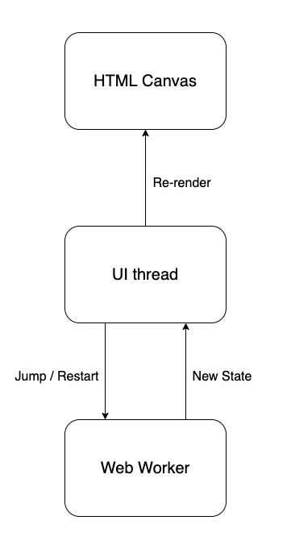

# dino-game

Simplified clone of the Google Chrome's [Dinosaur Game](https://en.wikipedia.org/wiki/Dinosaur_Game), no libraries

Check it out at [demo2.popovs.dev](https://demo2.popovs.dev)!

The original can be accessed at [chrome://dino](chrome://dino) in Chrome browser

## Architecture

Calculations are offloaded to a [Web Worker](https://developer.mozilla.org/en-US/docs/Web/API/Web_Workers_API). It ticks a set number of times per second, recalculating the state on every tick and sending it to the main thread.

The main thread is listening for key presses and messages from the worker. \
Messages from the worker trigger re-rendering. \
Key presses send a message to the worker, making it update the state accordingly.

## Running locally

- Start a dev server: `npm run dev`
- Build for prod: `npm run build`
- Serve the build output: `npm run preview`

Note: at the time of writing, the Web Worker doesn't work when using the dev server on Firefox because Vite's way of serving adds an import to the worker's script. \
Related [GitHub issue](https://github.com/vitejs/vite/issues/4586) and [Bugzilla issue](https://bugzilla.mozilla.org/show_bug.cgi?id=1247687)
